#### Data analysis of DDB_PD_138_AMBR and DDB_PD_139_AMBR experiments
### High-Density E. coli Fermentation using the High Throughput Ambr 250 Bioreactor System

Author: 
`Haroun Bensaadi`

**Version: 23.01.2024**

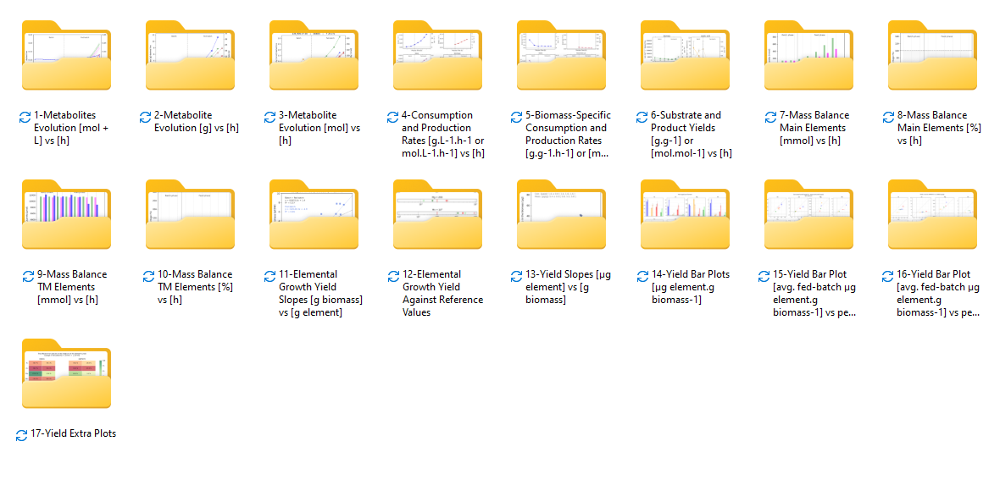

The repository represent parallel fermentations of high-density E. coli strains leveraging the state-of-the-art Ambr 250 high throughput bioreactor system conducted at the Pre-Pilot Plant (PPP) core unit at DTU Biosustain. 

The experimental setup consisted of running 12 parallel fermentations, each using a single-use bioreactor. The outcomes from this project are expected to make contributions to the publication of two research papers (see below).

The comprehensive analysis conducted during this project not only provided new insights into the physiology under investigation but also is scheduled for publication in a collaborative research paper featuring my name alongside other contributors.
Furthermore, the project led to the development of a novel bioinformatic tool for optimizing the elemental composition of the medium using a linear-programming approach. This tool is also set to be published in a second research paper, together with Dr. Suresh Sudarsan as two sole authors.

To gather insights from these fermentations, the integrated liquid handling platform of the Ambr system was programmed to extract samples from each bioreactor at regular time intervals, yielding 84 samples in total. Post-fermentation, I processed and fractionated these samples both manually and using the Tecan Fluent liquid handling platform, the samples were analyzed using LC-MS for their sugars, organic acids and trace metals content, both in the supernatant and dry biomass.
The resulting data of the 12 reactors from both the LC-MS analysis and live Ambr data was analyzed using Python scripting resulting in a codebase of approx. 3000 lines of code. 

The outcome included the generation of **over 350 plots**, including:
- Time evolution plots for the concentration, mass and quantity of the main metabolites (oxygen, carbon dioxide, D-glucose, NaOH, biomass, acetic acid, and tryptophan). 
- Uptake and production rates [g.L-1.h-1], growth rates [h-1], biomass-specific rates [g.g-1.CDW h-1], yields [g.g-1.glc],.
- Mass balance on the main elements (C, O, H and N), and the trace metal ions (Fe, Zn, Mg, Mn, Cu, Co, K, and Mo).
- Yields per trace metal ion [µg.g-1CDW],and elemental growth yields [g CDW g-1].
- Summary plots illustrating the impact of Fe and Zn quantity in the medium on the accumulation of each trace metal ion.

#### Pending papers:
“Comprehensive Metal Ion Analysis in High-Density E. coli Fermentation Processes” (Under Review)
    Authors: Dr. Suresh Sudarsan, Haroun Bensaadi, et al. 
    Projected publication date: June-July 2024

“Web-based Tool for Optimizing Metal Ion Requirements in Microbial Cultures” (In Preparation)
   Authors: Haroun Bensaadi, Dr. Suresh Sudarsan
   Projected publication date: May-June 2024

### Overview of some of the generated figures:
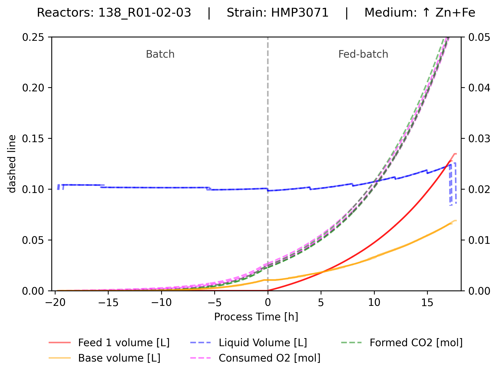
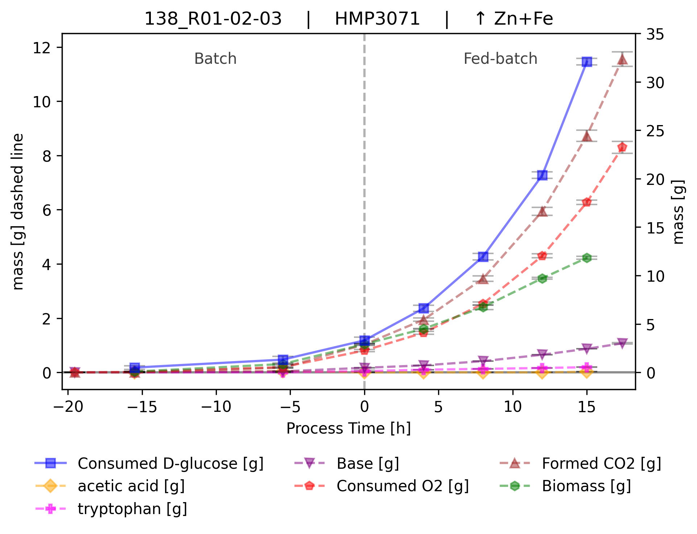
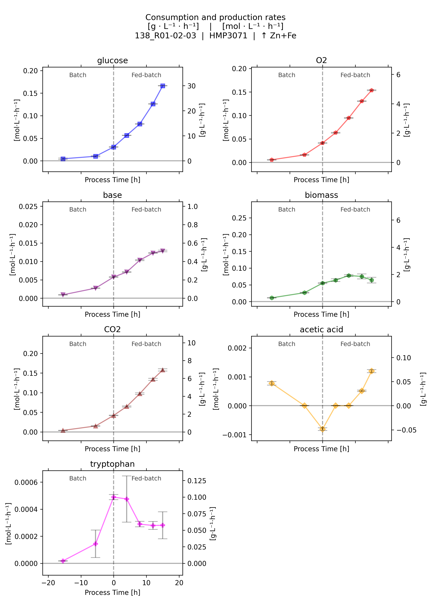
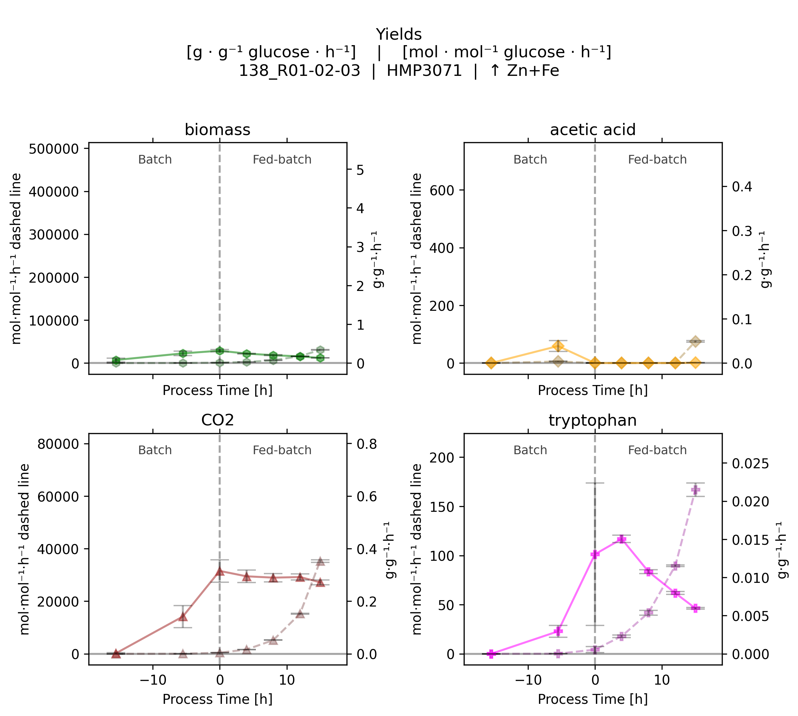
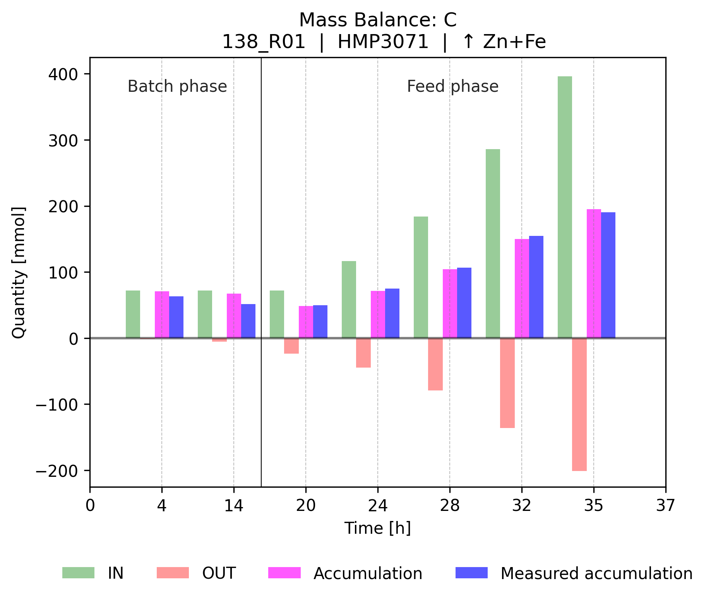
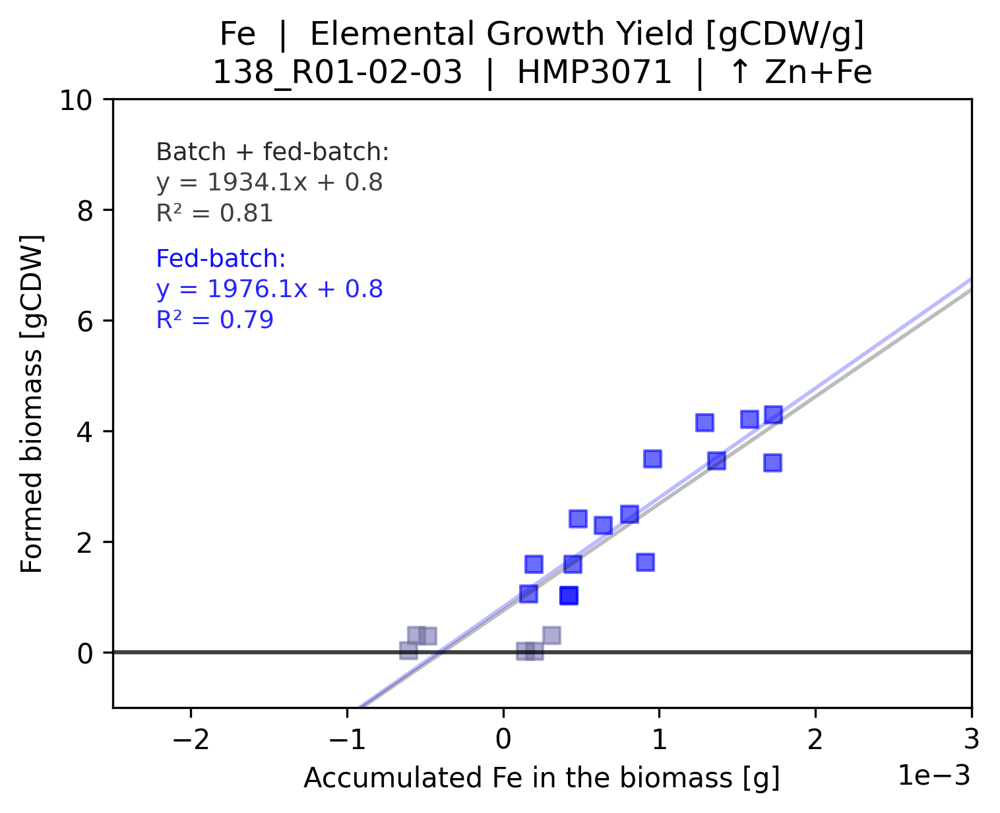
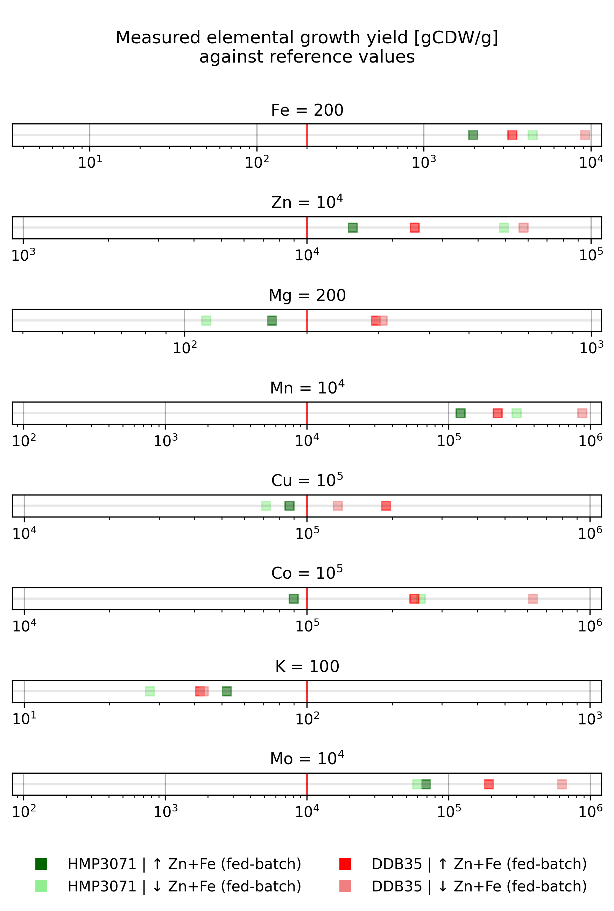

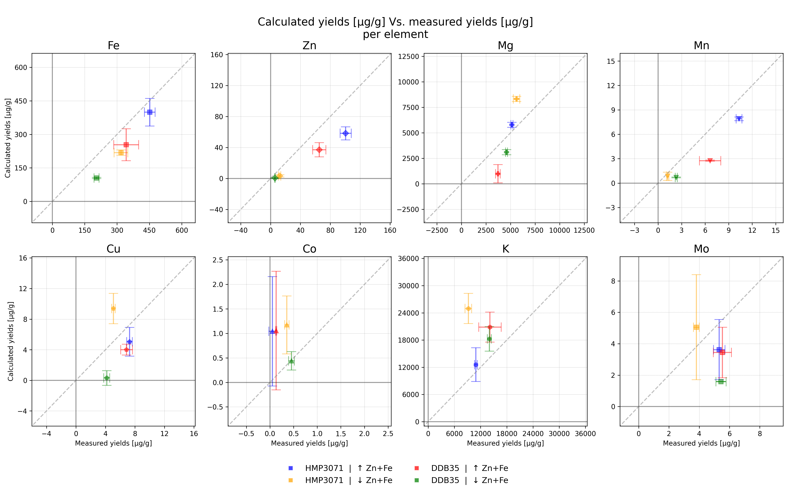
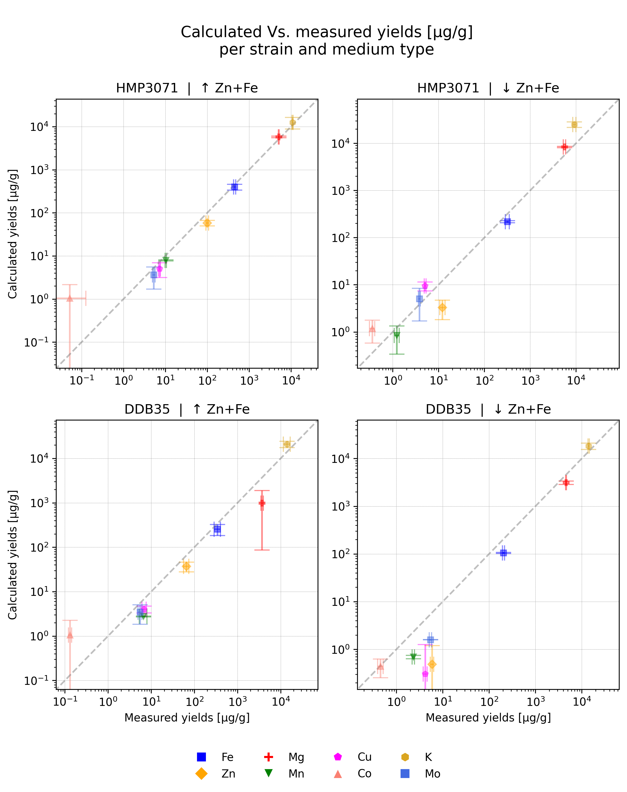
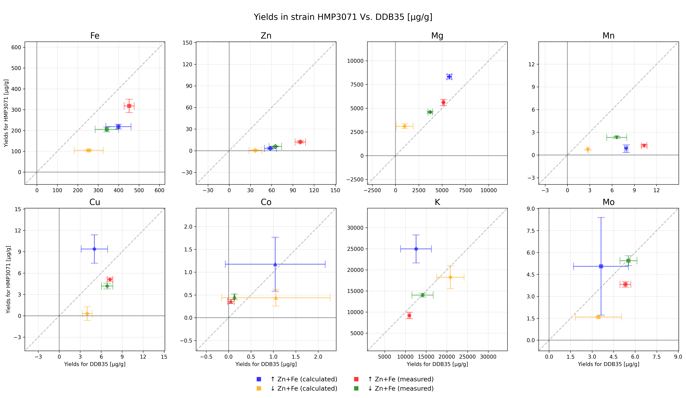
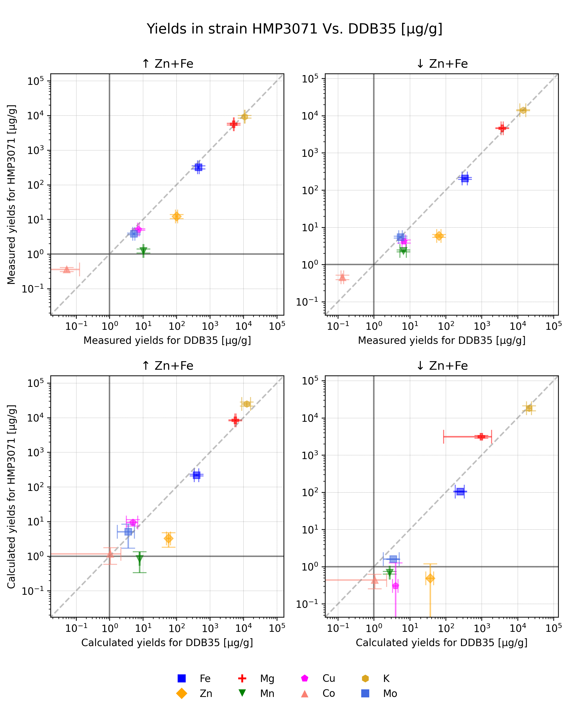
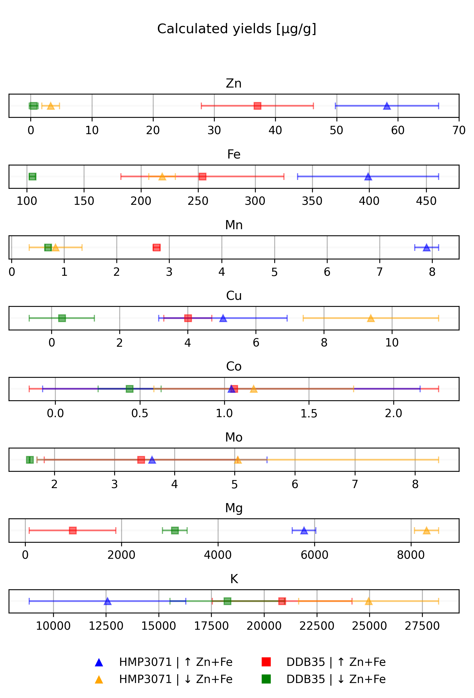
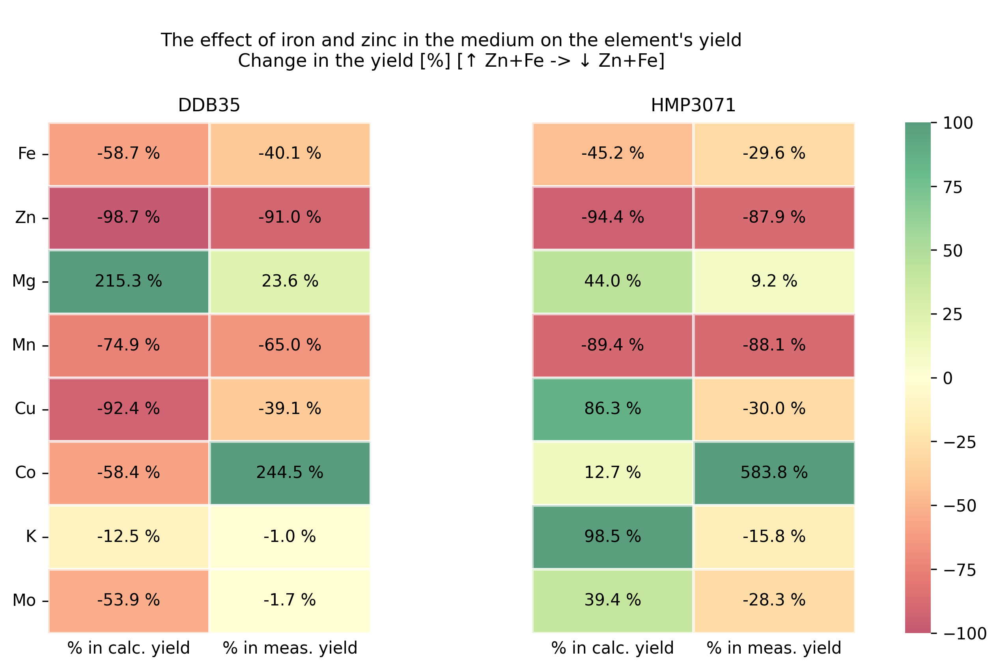